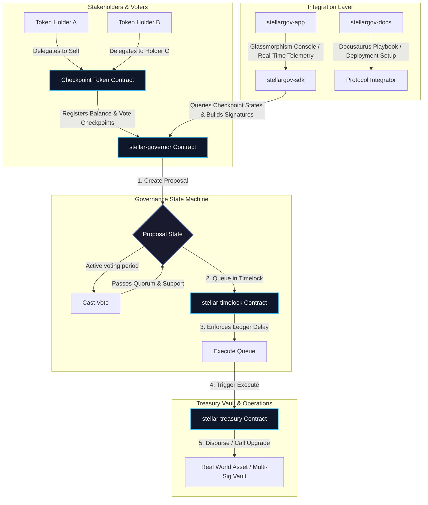

# StellarGov: Enterprise On-Chain Governance Infrastructure for Soroban

**The premiere fully on-chain governance and decentralized treasury management suite for DAOs, RWA funds, and institutional multi-sigs on the Stellar network.**

---

# 🗳️ Overview & Mission

With over $2B+ in tokenized assets deployed on Stellar, protocols, funds, and developers require robust, fully auditable governance systems to manage parameters, allocate capital, adjust treasury vaults, and upgrade software layers. 

StellarGov introduces a modular Compound-style Governor architecture built from the ground up for the **Soroban smart contract engine**. By leveraging historical checkpoint-based voting, custom timelocks, and multi-signature treasury gates, StellarGov guarantees institutional-grade safety, security, and performance.

### Key Pillars of the StellarGov Framework:
1.  **Checkpoint-Based Balance Voting:** Protects against host-level double-voting and instant balance-borrowing exploits (like flash loans) by registering chronological balance and delegation checkpoints during token transfers.
2.  **Decentralized Timelock Gateways:** Imposes a strict ledger-based execution delay on all passed proposals, giving DAO members sufficient time to withdraw capital or prepare for incoming changes.
3.  **Modular Treasury Custody:** Smart contract vaults that act as highly secure wallets, completely governed by on-chain vote outcomes and cryptographic proposal completions.

---

# 🏗️ Technical Architecture & Ecosystem Flow

The StellarGov ecosystem represents a multi-tiered architecture that integrates on-chain Rust smart contracts, a developer SDK, and a responsive frontend portal.

---

# 📂 The StellarGov Repository Suite

| Repository | Purpose | Primary Technologies | Core Features |
| :--- | :--- | :--- | :--- |
| **[`stellargov-contracts`](./stellargov-contracts)** | Core Smart Contracts | Soroban, Rust, Checkpoint Registries | Historical delegation, voting quorum tracking, timelocks, and treasury executes |
| **[`stellargov-sdk`](./stellargov-sdk)** | Developer Integration client | TypeScript, `@stellar/stellar-sdk` | Transaction serializations, signature creations, mock vote submission builders |
| **[`stellargov-app`](./stellargov-app)** | Analytical Governance Dashboard | React, Vite, Tailwind CSS, Lucide | Dark-mode telemetry, progress indicators, timelock queue viewers, delegation panels |
| **[`stellargov-docs`](./stellargov-docs)** | Governance playbooks | Docusaurus, Markdown, GFM | Migration maps (Solidity to Rust), parameter tuning, real-world asset (RWA) setup playbooks |

---

# 🛠️ Participating in Drips Wave 5

StellarGov is a fully open-source project created to elevate the developer ecosystem on Stellar. For Wave 5, we have outlined core contribution pathways for developers, designers, and documentation writers:

*   **Smart Contracts Engineering:** Optimizing the gas footprints of checkpoint registries and extending delegation contracts to support automated threshold changes.
*   **SDK Integrations:** Adding automated fee-bump calculations, Freighter wallet integrations, and transaction simulation checks before contract invocations.
*   **App UI/UX Design:** Creating gorgeous, animated charts visualizing voting distribution, quorum progress, and dynamic historical treasury yields.
*   **Technical Documentation:** Writing structured integration guides for tokenizing RWA protocols and deploying white-label DAO consoles.

---

# 📄 Maintainer Philosophy & Code Quality

We believe decentralized governance is the foundation of institutional and institutional-grade trust. Our technical design principles are built upon three core standards:
1.  **Security & Auditability:** Contracts undergo strict static analysis, and checkpoint structures are optimized to avoid out-of-gas scenarios during token delegation.
2.  **Zero Placeholders:** Every code module, script, and config file is fully operational and structured to represent an enterprise-ready environment.
3.  **Visual Excellence:** Interface applications are crafted to be breathtaking, utilizing modern glassmorphism layouts, subtle animation flows, and responsive UI components.

---

# 📜 License & Compliance

Distributed under the **Apache License 2.0**. See the `LICENSE` file in the repositories for details.

---

  Securing tokenized economies, institutional funds, and decentralized governance systems on Stellar.

