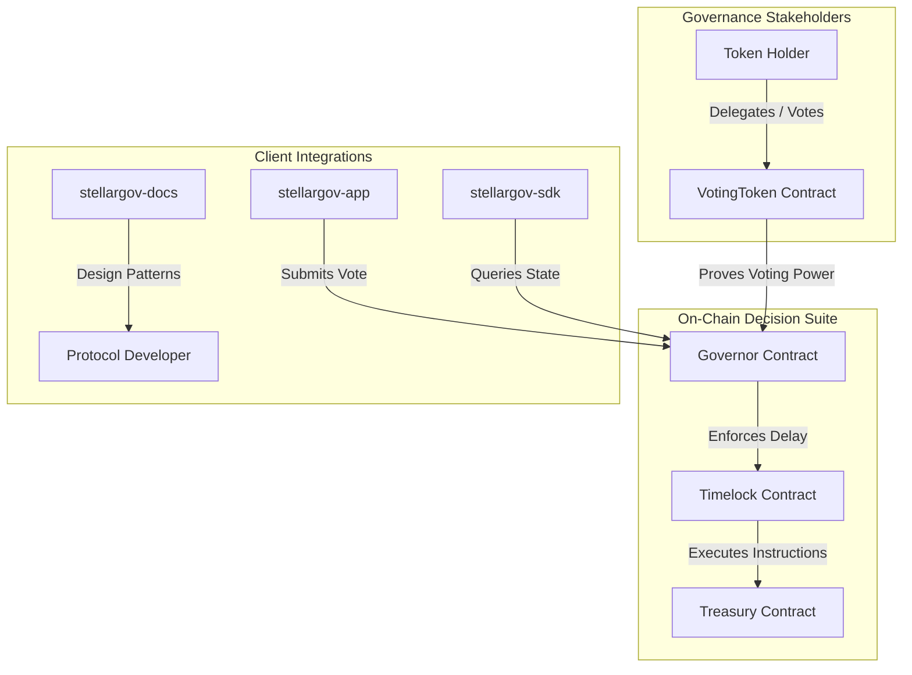

# StellarGov: On-Chain Governance Infrastructure for Soroban

**The first fully on-chain governance and decentralized treasury management suite for DAOs, RWA funds, and institutional multi-sigs on Stellar.**

---

# 🗳️ Overview

With over $2B+ in real-world assets deployed on Stellar, protocols and institutional funds require robust, auditable governance systems to manage parameters, adjust vaults, and distribute treasuries. StellarGov brings the gold-standard Compound Governor architecture to the Soroban smart contract framework. It provides a modular suite of contracts for checkpoint-based voting, proposal lifecycles, timelocks, and treasury custody, designed specifically for institutional scalability.

### Strategic Priorities:
*   **Decentralized Custody:** Ensuring DAO treasuries are exclusively managed by transparent, on-chain vote outcomes.
*   **Checkpoint Voting:** Preventing host-level double-voting via cryptographically verifiable historical balance checkpoints.
*   **Modular Safeguards:** Configurable timelocks that give community members sufficient time to react to governance executions.

---

# 🏗️ Ecosystem Architecture

The StellarGov ecosystem consists of a modular suite of smart contracts, a powerful client SDK, and an analytical dashboard.

---

# 📂 The StellarGov Repository Suite

| Repository | Primary Role | Core Technology |
| :--- | :--- | :--- |
| **[`stellargov-contracts`](./stellargov-contracts)** | Core on-chain logic. Governor, Timelock, Treasury, and VotingToken contracts. | Soroban / Rust / Checkpoint Registry |
| **[`stellargov-sdk`](./stellargov-sdk)** | High-level developer client. Serializes, signs, and executes proposals. | TypeScript / Stellar SDK |
| **[`stellargov-app`](./stellargov-app)** | Premium governance console. Visualizes active proposals, vote queues, and treasury holdings. | React / Vite / Tailwind / Recharts |
| **[`stellargov-docs`](./stellargov-docs)** | Governance playbook. Deployment blueprints, multi-sig guides, and best practices. | Docusaurus / Markdown |

---

# 🛠️ Participating in Drips Wave 5

StellarGov is open-source and welcoming ecosystem contributions. For Wave 5, we have prepared specific pathways:
*   **Smart Contracts:** Add support for optimistic governance execution and gas-optimized voting delegation.
*   **SDK Integrations:** Implement automatic gas estimation and batch proposal submission.
*   **App Dashboard:** Design and build interactive, real-time treasury allocation charts.
*   **Docs:** Create playbooks for transitioning classical enterprise multi-sigs into on-chain Stellar DAOs.

---

# 📄 Maintainer Philosophy

We believe decentralized governance is the foundation of institutional trust. Our philosophy is rooted in **safety, auditability, and modularity**. StellarGov does not force a single governance structure; instead, it provides secure lego blocks that allow builders to configure voting parameters, delays, and treasury controls to fit their specific regulatory and community needs.

---

# 📜 License

Distributed under the **Apache License 2.0**. See `LICENSE` for more information.

---

  Securing on-chain organizations and decentralized treasuries on Stellar.

